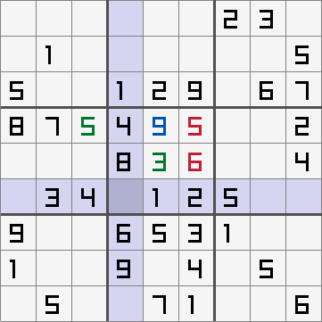

# Sudoku

### What is this?
It's a small sudoku game written in C using raylib. This is my first raylib project.

### How does it work?
The game picks a random pre-generated sudoku grid (which has exactly one solution) and applies a series of random changes to it, creating a new valid sudoku.

### How to build
Use `make run` with the provided makefile.
